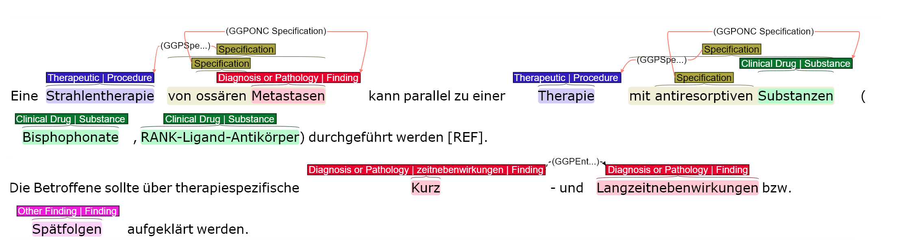

# GGPONC - The German Clinical Guideline Corpus for Oncology



see also:

| Repository | Description |
| ---- | ---- |
| https://github.com/hpi-dhc/ggponc_annotation | GGPONC 2.0 Results and Gold Standard Annotations |
| https://github.com/hpi-dhc/ggponc_preprocessing | Pre-Processing Pipeline (Tokenization, POS Tagging) and GGPONC 1.0 Results |
| https://github.com/hpi-dhc/ggponc_ellipses | Resolving Elliptical Compounds in German Medical Text |
| https://github.com/hpi-dhc/ggponc_molecular | GGTWEAK - Gene Tagging with Weak Supervision for German Clinical Text |
| https://github.com/hpi-dhc/xmen/blob/main/examples/03_GGPONC_NER.ipynb | GGPONC Entities + UMLS Grounding with xMEN |

# Preparation

1. Get access to GGPONC following the instructions on the [project homepage](https://www.leitlinienprogramm-onkologie.de/projekte/ggponc-english/) and place the the contents of the 2.0 and 3.0 releases (`v2.0_2022_03_24` and `v3.0_2023_01_23`) in the `data` folder
2. Install Python dependencies `pip install -r requirements.txt` `

# Named Entity Recognition

## Data Loading

A BigBIO-compatible data loader for loading the latest gold-standard annotations (GGPONC 2.0) to train NER models are available through the Hugging Face Hub: https://huggingface.co/datasets/bigbio/ggponc2

```python

from datasets import load_dataset
dataset = load_dataset('bigbio/ggponc2', data_dir='data/v2.0_2022_03_24', name='ggponc2_fine_long_bigbio_kb')

```

## Nested NER

A trained spaCy model for nested NER is available on Hugging Face: https://huggingface.co/phlobo/de_ggponc_medbertde

````
huggingface-cli download phlobo/de_ggponc_medbertde de_ggponc_medbertde-any-py3-none-any.whl --local-dir .
pip install -q de_ggponc_medbertde-any-py3-none-any.whl
```

see: [GGPONC_Nested_NER](GGPONC_Nested_NER.ipynb)

## Flat NER

TODO:

# Grounding

TODO

# Stylometric Analysis

TODO